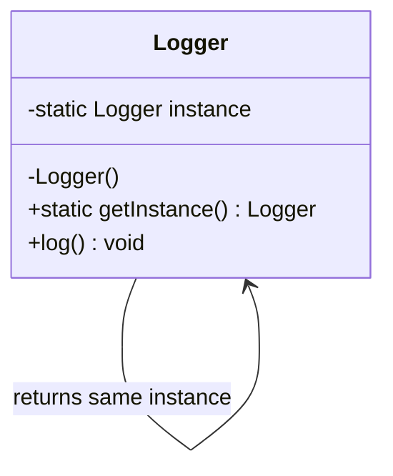

## Singleton Pattern

The **Singleton Design Pattern** ensures that a class has **only one instance** and provides a **global access point** to that instance.

### Key Points
- Only one object is created for the entire application.
- The same instance is reused whenever needed.
- Commonly used for logging, configuration, caching, and shared resources.

### Advantages
- Controlled access to a shared resource.
- Prevents multiple instances from causing inconsistent behavior.
- Saves memory by reusing the same instance.

### Disadvantages
- Can make unit testing harder.
- May introduce hidden dependencies.
- Can become a global state if overused.

### Mermaid Diagram

### Basic Flow
1. The constructor is made private.
2. A static method creates the instance if it does not exist.
3. The same instance is returned for all future requests.

### Example Use Cases
- Application settings manager
- Database connection pool controller
- Logger service
- Cache manager
